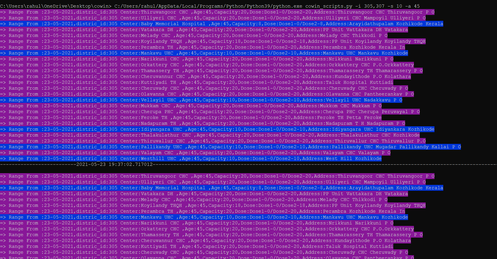

### Vaccination slot Alert based on District IDs or Pin Numbers
Intended to use for volunteers who are helping to figure out and help people for vaccination slots.
---------------------------------------------------------------------------------------------------


- Works with Python 3.6 and above.

```
 $ pip install requests argparse colorama
 $ python cowin_scripts.py --id id1,id2 -m pin (Using one or more pin numbers)
 $ python cowin_scripts.py --id dist1,dist2 -m districts (Using one or more districts ids)
 $ Press CONTRL + C to quit the execution
```
- Arguments and Optional arguments.
```
 $ python cowin_scripts.py --id id1,id2 -m pin/districts(Using distric or pin numbers)
 $ python cowin_scripts.py --id id1,id2 -m pin/districts -a min_age(it can be 18 or 45) & default is 18.
 $ python cowin_scripts.py --id id1,id2 -m pin/districts -s sleep_time (Default is 10 second)
 $ python cowin_scripts.py --id id1 -d -m pin/districts <customer start date dd-mm-yyyy/default is todays date) 
 $ python cowin_scripts.py --id id1,id2 -m pin/districts -v 2 (For second dose only ,default is for both the dose)
 $ python cowin_scripts.py --id id1,id2 -m pin/districts -b off (Mute the beep,default is on).
 $ python cowin_scripts.py --id id1,id2 -m pin/districts -r full/Available (Display all slots or only when it has capacity,Default is Available)
 $ python cowin_scripts.py --id 305,307 -s 15 -a 45 -d 24-05-2021  -m districts(Filtering data for 45 age groups with a duration of 15 and a default starting date)
 $python.exe cowin_scripts.py -i 673004,560066 -s 20 -a 18 -m pin (Filtering for age 18 ,with a sleep of 20 seconds and mode is based on pin numbers)
 $usage: cowin_scripts.py [-h] -i ID [-d DATE] [-a {18,45}] [-s SLEEP] [-v {0,1,2}] [-b {on,off}] -m {pin,districts} [-r {all,Available}]

optional arguments:
  -h, --help            show this help message and exit
  -i ID, --id ID        District IDs or Pin numbers.
  -d DATE, --date DATE  Custom start date,Default is current date.
  -a {18,45}, --age {18,45}
                        Minimum age,Default is 18.
  -s SLEEP, --sleep SLEEP
                        Slpping time,Default is 5sec.
  -v {0,1,2}, --vdose {0,1,2}
                        Vaccine dose 1 or 2,Default is for both.
  -b {on,off}, --beep {on,off}
                        Make Beep on /off,Default is on.
  -m {pin,districts}, --mode {pin,districts}
                        Select the mode as pin or district.
  -r {all,Available}, --report {all,Available}
                        Display all slots or only with slots
 
```
- Result



- All argeuments except --id /-i & -m/--mode are optional.
- Distric IDs can be fetch from cowin sites.
- It will beep if it identifies a slot & change the color of display (BLUE <10 and Green >10 capacities).
- It will be usefull while you are working and dont need to watch your phone for alerts too.
- The date will be cahed up to 30mnts per COWIN APIs ,than realtime.
- It wont make any booking as obevious.
- All credit and data accuracy goes to COWIN APIs.
